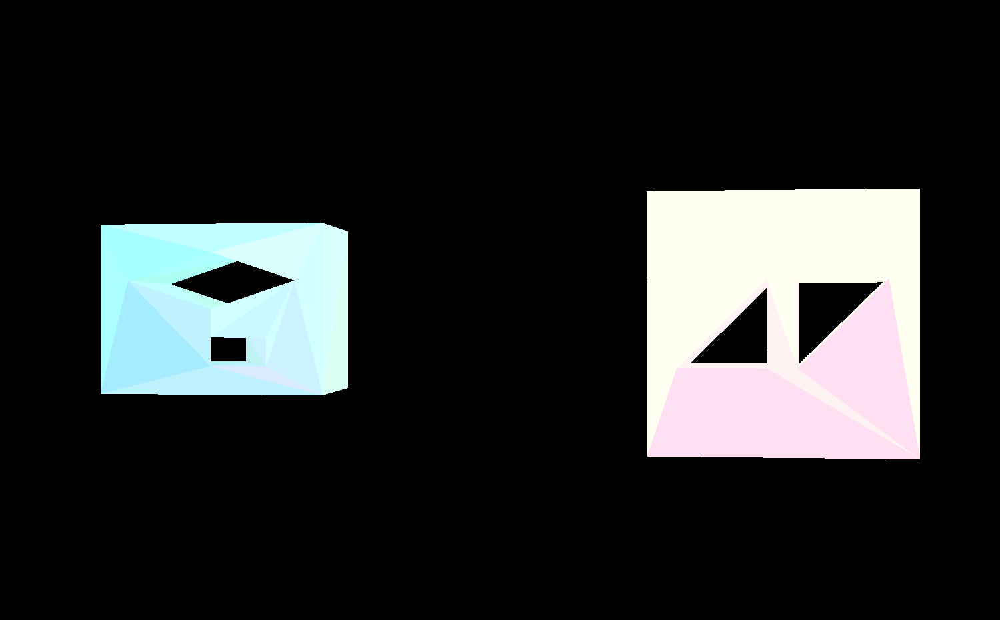
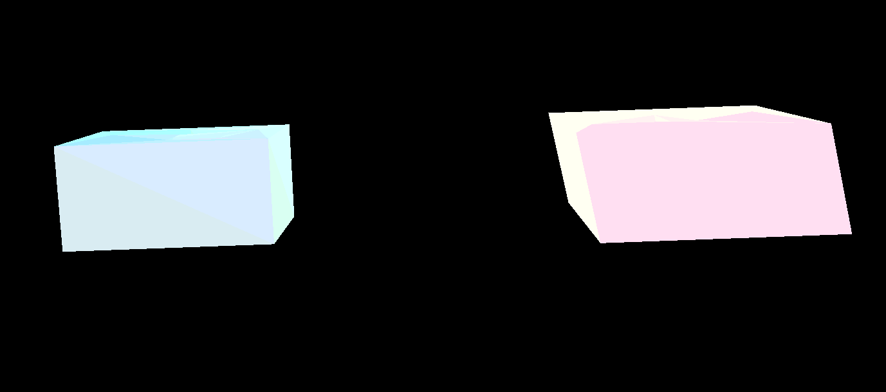

# Installation

```bash
git clone https://github.com/zpqqq10/cadEuler.git
cd cadEuler
sudo apt-get install build-essential libgl1-mesa-dev libglfw3 libglfw3-dev libglew2.2 libglew-dev libglm-dev
mkdir build && cd build
cmake .. && make
./main
```

鼠标左右上下拖动可以旋转实体，上下方向键或者 ws 键可以控制视角前后移动，esc 键退出程序。

# Structure

运行环境：

```bash
$ uname -a
Linux 4090msi 6.2.0-26-generic #26~22.04.1-Ubuntu SMP PREEMPT_DYNAMIC Thu Jul 13 16:27:29 UTC 2 x86_64 x86_64 x86_64 GNU/Linux
```

代码结构：

```bash
.
├── 3rdparty        # 第三方库，未使用
├── build           # 编译目录
├── CMakeLists.txt  # cmake文件
├── include         # 头文件
│   ├── ds.hpp      # 半边数据结构定义
│   ├── euler.hpp   # 欧拉操作定义
│   ├── GUI.hpp     # 可视化部分定义，与opengl相关
│   └── painter.hpp # 绘制定义，与opengl相关
├── README.md
└── src             # 源文件
    ├── euler.cpp   # 欧拉操作实现
    ├── GUI.cpp     # 可视化部分实现，与opengl相关
    ├── main.cpp    # 主函数
    └── painter.cpp # 绘制实现，与opengl相关
```

# Summary



图片中左边偏蓝色的实体由欧拉操作`mvfs(), mev(), mef(), kemr(), krmrh()`生成，右边偏红色的实体通过对一个带有两个内环的面进行扫成操作`sweep()`生成。



1. 定义数据结构时，本来每个`Vertex`的坐标和颜色分别用一个`glm::vec3`表示。但是后来发现绘制带内环的面需要使用`GLUtesselator`，因此直接将坐标颜色的存储方式统一到了`GLdouble data[6];`。
2. `HalfEdge`是半边数据结构的核心，需要操作要维护双向循环链表，因此一前一后两个指针不能避免。而其他结构其实能够以特定方式遍历即可，因此采用了`std::list`存储。
3. 点和环的选取非常重要。比如`kemr()`传入的三个参数，两个点要注意哪个在最后的外环上，哪个在最后的内环上，传入的环应该是最后要形成的外环。
4. 通过代码实践对半边数据结构有了更深刻的理解，对三维 CAD 建模也有了简单的体会。
